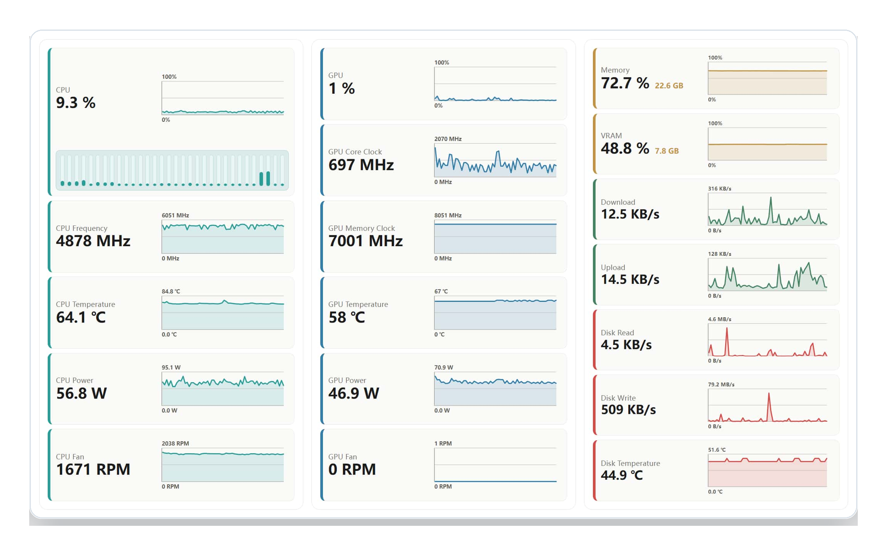

<p align="center">
  
</p>

<h1 align="center">Stats Panel</h1>

<p align="center">
  A compact Windows performance monitor for a dedicated desktop corner or secondary display.
</p>

<p align="center">
  <a href="https://github.com/Cekavis/stats-panel/actions/workflows/ci.yml"></a>
  <a href="https://github.com/Cekavis/stats-panel/actions/workflows/release.yml"></a>
  <a href="https://github.com/Cekavis/stats-panel/releases/latest"></a>
  <a href="https://github.com/Cekavis/stats-panel/releases"></a>
  <a href="LICENSE"></a>
  
  
</p>



## Why Stats Panel

Stats Panel is built for people who want a quiet, always-visible hardware dashboard without a full monitoring suite covering the desktop. It focuses on readable live telemetry, predictable layout, and graceful unavailable states when a sensor is not exposed by the current machine.

## Features

- Real-time CPU, memory, network, and disk telemetry through `sysinfo`.
- NVIDIA GPU telemetry through NVML when an NVIDIA driver is available.
- CPU temperature, CPU power, CPU/GPU fan speed, and disk temperature through the bundled sensor helper when hardware access is available.
- Integrated PawnIO setup path for hardware that needs a low-level sensor driver.
- Grouped metric visibility, compact charts, configurable sampling, and configurable chart history.
- Light, Dark, and Auto themes with local preference persistence.
- Borderless resizable dashboard window with tray restore/quit actions and a separate settings window.
- Windows installer bundles built by Tauri.

## Download

Download the latest Windows installer from [GitHub Releases](https://github.com/Cekavis/stats-panel/releases/latest).

The NSIS setup executable is the recommended installer for most users. MSI bundles are also published for environments that prefer Windows Installer packages.

## Sensor Notes

Windows exposes CPU usage, memory, network, and disk activity without special setup. CPU temperature, CPU power, fan speeds, and disk temperature depend on hardware, firmware, and available sensor access.

Stats Panel runs normally without administrator privileges. Elevation is only requested when installing or repairing the integrated PawnIO sensor driver. Systems without NVML or unavailable sensors report those metrics as unavailable instead of showing placeholder data.

## Development

Install dependencies:

```powershell
rtk npm install
```

Run the desktop app:

```powershell
rtk npm run tauri dev
```

Build and validate locally:

```powershell
rtk npm run build
rtk cargo test
rtk cargo clippy --all-targets -- -D warnings
```

Run Cargo commands from `src-tauri` when invoking Cargo directly.

## Release

Releases are built by GitHub Actions when a version tag is pushed:

```powershell
git tag v0.2.29
git push origin v0.2.29
```

The release workflow checks that the tag matches the version recorded in the project files, builds the Windows Tauri bundles, creates a GitHub Release, and uploads installer assets automatically.

## License

Stats Panel is licensed under the [MIT License](LICENSE).
